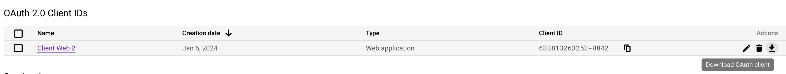

# quizz

install node js on your machine https://nodejs.org/en/download


configure googlesheet apikey on https://console.cloud.google.com/

api & services > + enable apis and services > google sheets API > enable

on apis & services page > credentials > + create credentials > Oauth Client ID

- application type : web application
- name: cafedukoin
- Authorized redirect URIs : http://localhost

save it, you're back on credentials page. You just need to download


create a file `.env` and complete it with the JSON that you downloaded previously

````
GOOGLE_SHEETS_API_KEY_TYPE=
GOOGLE_SHEETS_API_KEY_PROJECT_ID=
GOOGLE_SHEETS_API_KEY_PRIVATE_KEY_ID=
GOOGLE_SHEETS_API_KEY_PRIVATE_KEY=
GOOGLE_SHEETS_API_KEY_CLIENT_EMAIL=
GOOGLE_SHEETS_API_KEY_CLIENT_ID=
GOOGLE_SHEETS_API_KEY_AUTH_URI=
GOOGLE_SHEETS_API_KEY_TOKEN_URI=
GOOGLE_SHEETS_API_KEY_AUTH_PROVIDER_X509_CERT_URL=
GOOGLE_SHEETS_API_KEY_CLIENT_X509_CERT_URL=
GOOGLE_SHEETS_API_KEY_UNIVERSE_DOMAIN=
SPREADSHEET_ID=
SHEET_NAME=
````

to run it use `node server.js`
